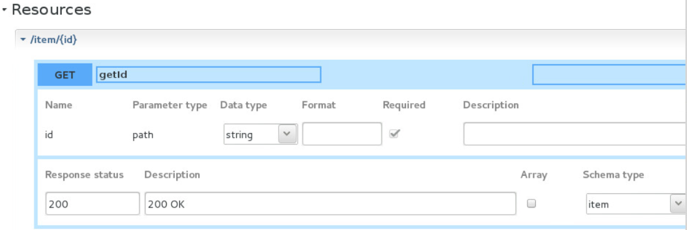
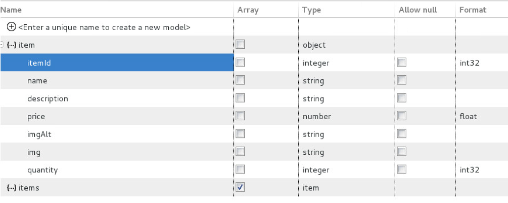
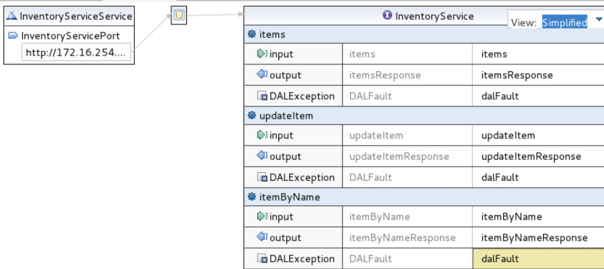
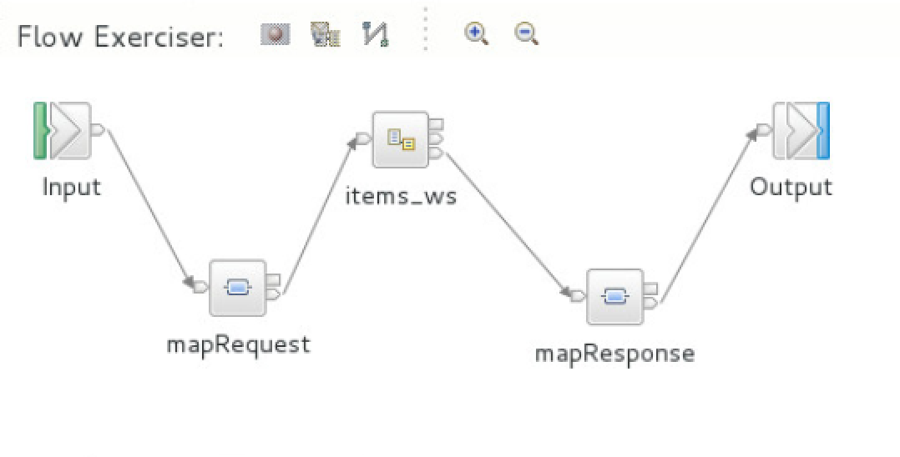
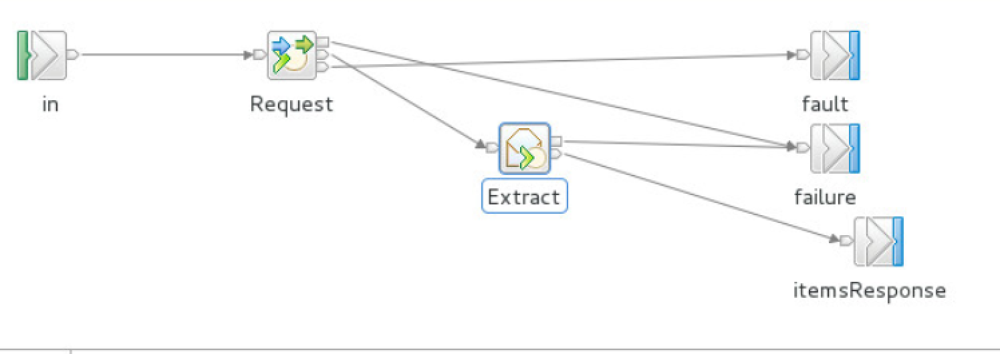
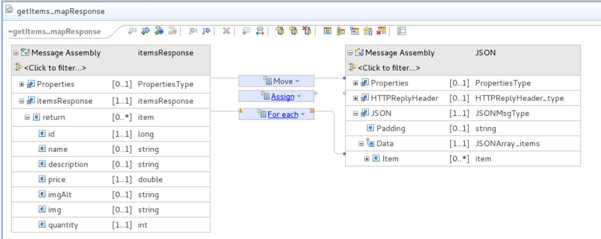

# Inventory Flow - Integration Bus

This project is part of the 'IBM Integration Reference Architecture' suite, available at [https://github.com/ibm-cloud-architecture/refarch-integration](https://github.com/ibm-cloud-architecture/refarch-integration). It demonstrates how an IBM Integration Bus runtime can be deployed on premise, running the gateway flow to expose REST api from a SOAP back end service, and can be deployed to IBM Cloud private.

# Table of Contents
* [IIB background](https://github.com/ibm-cloud-architecture/refarch-integration-esb#ibm-integration-bus-background)
* [Installation](https://github.com/ibm-cloud-architecture/refarch-integration-esb#ibm-integration-bus-background)
* [Flow implementation](https://github.com/ibm-cloud-architecture/refarch-integration-esb#inventory-flow)
* [CI/CD](https://github.com/ibm-cloud-architecture/refarch-integration-esb#cicd)
* [Service Management](https://github.com/ibm-cloud-architecture/refarch-integration-esb#application-performance-management)
* [Compendium](https://github.com/ibm-cloud-architecture/refarch-integration-esb#compendium)

# IBM Integration Bus Background

IBM Integration Bus is a market-leading lightweight enterprise integration engine that offers a fast, simple way for systems and applications to communicate with each other. As a result, it can help you achieve business value, reduce IT complexity and save money.
IBM Integration Bus supports a range of integration choices, skills and interfaces to optimize the value of existing technology investments.

[](https://www.youtube.com/watch?v=qQvT4kJoPTM)


# Server installation
## On-premise
For the on-premise solution a standard installation was done following the instructions from the [product documentation](https://www.ibm.com/support/knowledgecenter/en/SSMKHH_10.0.0/com.ibm.etools.mft.doc/bh25992_.htm).

We created a new virtual machine with one of the supported linux OS.
1. Download the developer edition:    
```
   wget http://public.dhe.ibm.com/ibmdl/export/pub/software/websphere/integration/10.0.0.9-IIB-LINUX64-DEVELOPER.tar.gz
```

1. Install the downloaded file into /opt/ibm:
```
   mkdir /opt/ibm
   tar -xf 10.0.0.9-IIB-LINUX64-DEVELOPER.tar.gz --exclude iib-10.0.0.9/tools --directory /opt/ibm
```
1. Review the license agreement and if acceptable accept using the following
command:
```
   /opt/ibm/iib-10.0.0.9/iib make registry global accept license silently     
```
Remember that to start the IIB toolkit you can use the `<install_dir>/iib toolkit` command.

## Docker
Read [Building a docker image that include IBM Integration Bus and IBM MQ embedded using the Developer Editions](docker/README.md)
# Inventory Flow
This section addresses how the flow was created. We develop a REST API using IBM Integration Toolkit. ([See product documentation])(https://www.ibm.com/support/knowledgecenter/en/SSMKHH_10.0.0/com.ibm.etools.mft.doc/bi12036_.htm)

If you want to access the project, open the toolkit and use import > General > Import existing project, then select the refarch-integration-esb/integration/RESTAPI project.

In the API Description the base URL is set to **iib/inventory-api** (this is defined in the header section), then for the resources the following operations are defined:
* /item/{id} GET, PUT, DELETE
* /items GET, POST



The model definition defined item and items as:


The service to consume is from the [Data Access Layer]() project, and represents a SOAP WSDL interface, as illustrated in following figure:



The project needs to do protocol and data mapping, via the implementation of flows. ([See product documentation](https://www.ibm.com/support/knowledgecenter/en/SSMKHH_10.0.0/com.ibm.etools.mft.doc/bi12020_.htm)).
The flow below presents the get items operation:   



The input string is mapped to the itemid for the soap request, the call to the DAL SOAP service is done inside the items_ws node:

  

and the response is mapped back to json item array in the mapResponse node:



The same logic / implementation pattern is done for the other flows supporting each REST operations. All the flows are defined in the integration/RESTAPI folder.

| Operation | Flow name | Map |
| --------- | -------- | ----- |
| get item  | getId.subflow | getId_mapRequest, getId_mapResponse |
| put item  | putId.subflow | putId_mapRequest, putId_mapResponse |
| delete item  | deleteId.subflow | deleteId_mapRequest, deleteId_mapResponse |
| get items | getItems.subflow | getItems_mapRequest, getItems_mapResponse |
| post items | postItems.subflow | postItems_mapRequest, postItems_mapResponse |


## Deploy manually using Docker 
See the article [Deploying the application using Docker locally](deploy/README.md)

## IBM Cloud private
See the article [Deploying a new instance of IBM Integration Bus on IBM Cloud private deploying the newly created application](IBMCloudprivate/README.md)


# CI/CD

The elements of the IIB project are text files that are pushed to github repository. It is easy to have a Jenkins file to automate the integration and deployment, using Apache ant. [This article ](https://developer.ibm.com/integration/blog/2015/10/02/continuous-build-and-deploy-automation-with-ibm-integration-bus-v10-using-ant-git-and-jenkins/) describes one of the potential approach.

The steps can be summarized as:
1.Build shell scripts to use IIB commands `mqsicreatebar` and `mqsipackagebar`
1.Integrate the script in a jenkins file
1.Define a jenkins pipeline to reference the github project
1.Deploy the IIB product on the Jenkins server to access build capabilities.

To tune.

# Application Performance Management

To get visibility into the IIB runtime and server performance metrics, a APM agent is installed on the server.
[The instructions are here](https://www.ibm.com/support/knowledgecenter/SSHLNR_8.1.4/com.ibm.pm.doc/install/iib_linux_aix_config_agent.htm#iib_linux_aix_config_agent)

# Compendium

* [View the IBM Integration Bus Dockerfile repository on Github](https://github.com/ot4i/iib-docker)

* [Learn more about IBM Integration Bus Docker Tips and Tricks](https://developer.ibm.com/integration/blog/2017/04/04/ibm-integration-bus-docker-tips-tricks/)

* [Learn more about IBM Integration Bus and Kubernetes](https://developer.ibm.com/integration/blog/2017/08/21/first-look-using-ibm-integration-bus-kubernetes/)

* [Learn more about running IBM Integration Bus in the Bluemix Container Service](https://developer.ibm.com/integration/blog/2016/11/18/run-ibm-integration-bus-in-bluemix-in-3-easy-steps/)

* [Learn more about IBM Integration Bus](https://www.ibm.com/support/knowledgecenter/en/SSMKHH_10.0.0/com.ibm.etools.msgbroker.helphome.doc/help_home_msgbroker.htm)

* [Learn more about IBM Integration Bus and Docker](https://www.ibm.com/support/knowledgecenter/en/SSMKHH_10.0.0/com.ibm.etools.mft.doc/bz91300_.htm)
