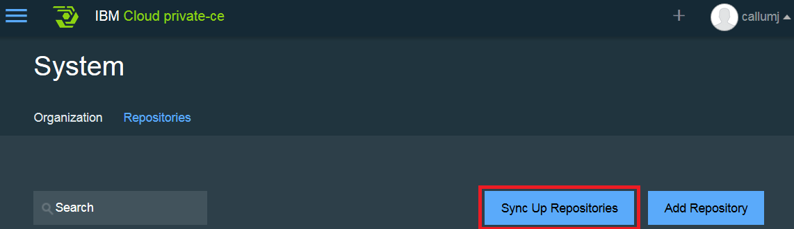
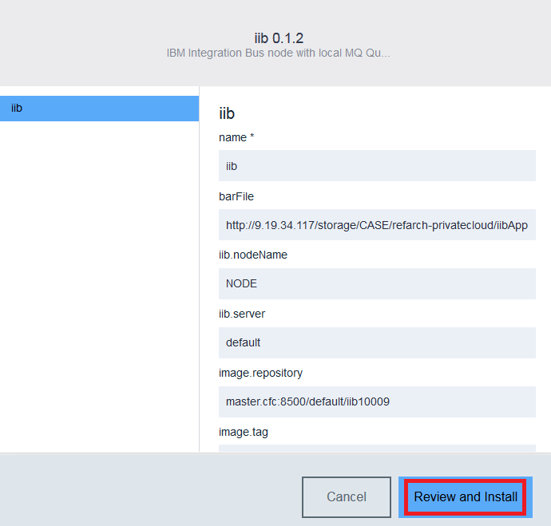
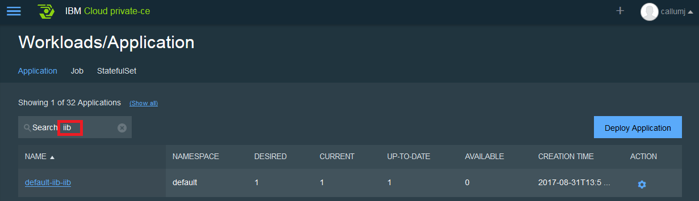

# Deploying IIB Application to IBM Cloud private

This article documents how to build a deployable BAR file for the Integration
application which will run in IIB, as a container image running in IBM Cloud private

## Prerequisite
As a prerequisite, IBM Integration Bus needs to be installed on the machine. See instructions
in [main readme](https://github.com/ibm-cloud-architecture/refarch-integration-esb#on-premise)  
* It is assumed that you have already cloned the git repository

## Building the IBM Integration Bus Application

1. Run the mqsiprofile command to setup the environment:
   . /opt/ibm/iib-10.0.0.9/server/bin/mqsiprofile

1. Run the following command to generate the BAR file:
   mqsipackagebar -a iibApp.bar -w /iibmqDocker/refarch-integration-esb/integration -k RESTAPI

1. Upload the BAR file to an HTTP Server so it can be available to the docker container during start-up. Use whatever mechanism you like to upload the file to the HTTP server, I used scp:     
   scp iibApp.bar callumj@9.19.34.117:/storage/CASE/refarch-privatecloud   

## Creating an Application instance in IBM Cloud private - App Center

1. Log into the IBM Cloud private Web UI, and navigate to the System page, and click **Sync Up Repository**:  

   
   Confirm the Sync operation.

1. Open the **App Center**, and type IIB within the search bar:      

   

1. Click on the **Install Package** button, and customize the locations for your Integration Bar file, and potentially the Docker image. Click **Review and install** button to view the final configuration:     

   

1. Click **Install** to start the installation process.

1. A success pop-up will appear.

1.  Navigate to the Applications section:      

    

1. Within the search bar enter **iib** and an application should be shown:   

        
   At this stage it may show the available as **0** as the containers are still being created.

1. Click into the application to view the details:  
   

1. To verify the solution is working by clicking on the **access webui** link. This should load the IIB Web UI within a browser.
