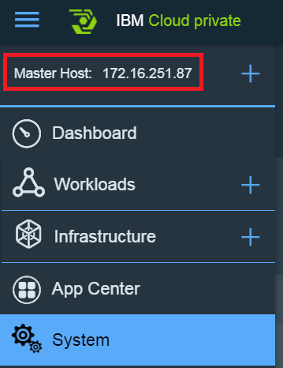
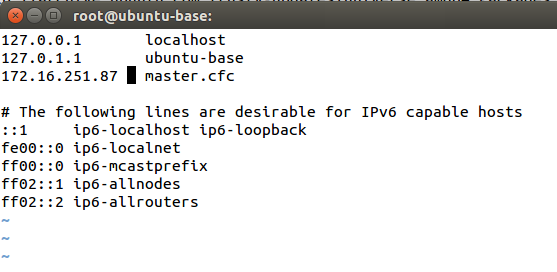

# Build docker image for IIB

The project includes two directories under docker folder:
* mq - provides a Dockerfile for building an MQ image suitable for IIB internal usage.
* iib - provides a Dockerfile for building an IIB image using the above mq image as a base.

This instructions were created by using a base Ubuntu 14.04, with docker already installed.

## Creating the MQ base and IIB docker images
We assume this project was clone via git clone or the script [clonePeers.sh](https://github.com/ibm-cloud-architecture/refarch-integration/blob/master/clonePeers.sh)

1. Run Docker build command to create the docker image named **mqbase** using the local dockerfile definition:
 ```
 docker build -t mqbase refarch-integration-esb/docker/mq/.
 ```

1. Run the Docker build command to create the **iib10009** docker image locally:
 ```
 docker build -t iib10009 refarch-integration-esb/docker/iib/10.0.0.9
 ```

1. Pushing the docker image
 The docker images is currently located on your local machine, and often it will be required to publish into a central docker repository. For instance the docker repository associated with an IBM Cloud private environment or the Bluemix Container Repository. The following instructions document the process to push the image, and are a walk through of the process documented within the knowledge center:
https://www.ibm.com/support/knowledgecenter/en/SSBS6K_1.2.0/manage_images/using_docker_cli.html

1. The IBM Cloud private master node IP address needs to be identified, this can be found in the top left corner of the admin console:    
   

   This will be hosting the docker repository normally on port **8500**.

1. The master.cfc hostname needs to resolve locally to the identified IP address. Therefore a new entry will be added into the local host file:     
   vi /etc/hosts     
   172.16.251.87    master.cfc     
   

1. Login into the master node and copy the  /<installation_directory>/misc/configure-registry-cert.sh file to the local machine.

1. Run the downloaded script file:    
   sudo ./configure-registry-cert.sh

1. The script will install a new certificate on the machine, docker needs to be restarted to pick up the change:     
   service ssh restart
   service docker restart

1. You should now be able to login to the docker repository:     
   docker login master.cfc:8500
   Login in as the administrator of the repository: *admin*
   using the same pass that you use for the web administration console

1. The create image can now be tagged and uploaded to the docker repository:    
   docker tag iib10009 master.cfc:8500/default/iib10009:dev
   docker push master.cfc:8500/default/iib10009:dev
